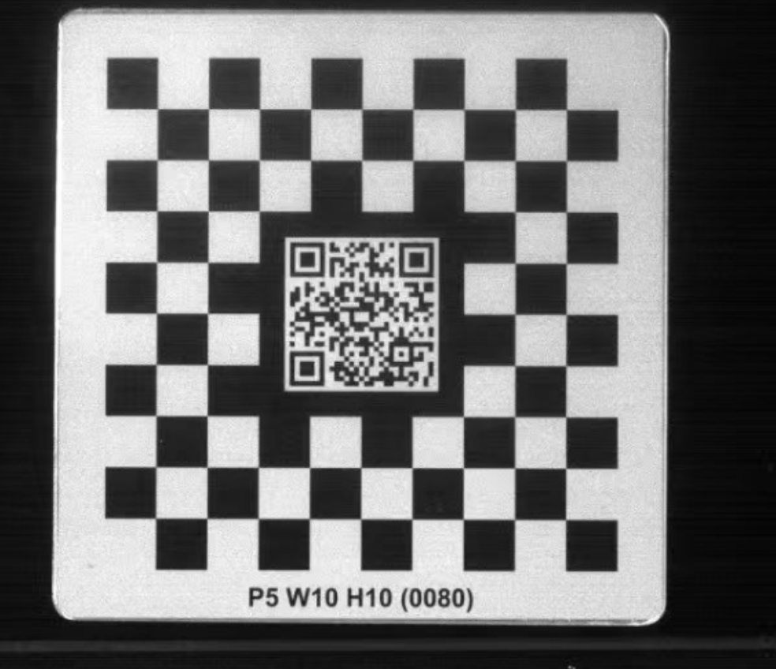

1. 二维码的作用：思谋的二维码的作用---1.识别标定板的信息 2.根据二维码的特征确定

和师兄确认：
二维码方面：
任务目标：思谋的二维码，包含标定板的棋盘格尺寸等信息,把标定板的二维码，再加上站点信息。

具体细节：站点信息是什么？扫出来的文本内容是什么？ 

标定方面：
1. 

提示词：
给我按照这些信息设计标定板，要和图片上的长的差不多，要方一个二维码在中心，现在用的相机是realsense d435i,工作区间大概在40-70cm,按照行业
  标定的规范给我设计最佳的标定板，然后把你的标定板相关的所有信息和细节写在一个.md文档中，然后我后续要拿这个md文档给ai让他生成一段python代
  码，直接生成标定板的pdf

不是——这正是二维码作为"方向锚点"存在的意义。角点索引是绑定在标定板自身坐标系里的物理属性，不随相机视角变化而变化；相机旋转改变的只是角点在图像中的像素位置和排列顺序的"视觉表现"，软件通过解码二维码本身自带的方向信息，始终能把"图像中看到的第i个角点"对应回"板上编号为i的那个物理角点"。
关键：区分两套坐标系
坐标系	是否随相机旋转变化	说明	
标定板坐标系（Board frame）	不变	原点固定在二维码某一角，X/Y轴沿棋盘行列方向，Z轴垂直板面，这是板的"物理身份证"，角点索引定义在这里	
相机坐标系（Camera frame）	变化	相机转到哪一侧，板在图像里的像素坐标、旋转方向都会变，但这只影响"看到的样子"，不影响板的自身定义	
角点索引属于前者。把板翻转180°后再看，板的左上角这个物理点依然是编号 (0,0)，只是它在你的视网膜（或相机传感器）上投影到了图像的右下角而已。
二维码如何解决"分不清方向"的问题
纯棋盘格确实存在你担心的180°旋转二义性——从反面看,角点拓扑完全对称，无法判断哪个是"真正的第一个角点"。二维码的作用就是消除这种歧义：
二维码本身携带方向信息：QR码的定位图案（三个回字形方块）天然不对称，解码器能明确判断"哪个角是二维码的左上角"；
算法以二维码方向为基准：OpenCV的QRCodeDetector返回的四个角点顺序是固定的——point #1 始终对应二维码自身的左上角，无论板在图像中怎么旋转；
据此建立唯一的板坐标系：以二维码的point #1为原点，沿其两条边定义X/Y轴，再外推到整个8×8棋盘，每个物理角点的索引就此锁定。
也就是说，相机从正面看、从反面看、从斜45°看，软件算出的都是"板坐标系下编号(0,0)的那个物理角点"，只是它在图像里的像素坐标不同。相机旋转 information 体现为相机坐标系到板坐标系的外参（R, t）发生变化，而不是板内部索引的重新排列。
什么情况下索引才会"变"
只有在二维码无法解码或被遮挡时，方向锚点才会丢失，此时才会退化成你担心的状况——算法只能靠棋盘格拓扑猜方向，180°翻转时可能出现整张角点表左右/上下镜像的情况。这也是为什么实际使用中要保证二维码清晰可见，以及为什么一些高可靠性方案（如AprilGrid、ChArUco）会在多个方格里嵌入独立ID，即使部分被遮挡也能通过剩余Tag的唯一ID反推方向。
工程上的验证方式
想直观感受"索引不变"，可以做个简单实验：
用记号笔在板的某个物理角点（比如二维码左上角那一侧的第一个内角点）上画个点；
从正面、反面、斜方向分别用VisionSensor读取角点数组；
对比标记点在返回数组中的索引值——只要二维码每次都能成功解码，这个索引值就不会变，变化的只是该索引对应的像素坐标和相机外参。
一句话总结：二维码给了板一个"内在的、不依赖观察者的方向定义"，相机怎么转都只是在改变观察视角，不会改变板自身的角点编号系统；只有在二维码失效时，方向锚点丢失，索引才会变得不可靠。

可以，VisionSensor内部对每个角点都有唯一的行列索引，但软件界面通常不会直接显示编号标签，编号关系主要体现在算法内部的数据结构和输出接口中。以下从原理、默认规则、实操三个层面展开说明。
角点编号的建立逻辑
VisionSensor之所以能区分每个角点，依赖的是"二维码原点 + 棋盘拓扑 + 已知物理尺寸"这三要素：
二维码提供唯一原点与方向：板上中心二维码被解码后，软件即可确定板的正方向（二维码的"回"字方向约定为上），从而消除棋盘格180°旋转的二义性；
行列拓扑生成索引：以二维码左上角（或板左上角）为原点，按 X8 × Y8 = 8×8 的角点网格，为每个角点分配唯一的 索引；
物理坐标绑定索引：结合 P5（格距5mm），每个索引对应的物理坐标为 (col × 5, row × 5, 0) mm，原点处为 (0, 0, 0)。
这套逻辑与OpenCV的 findChessboardCorners + calibrateCamera 流程一致：检测到的角点顺序必须与预生成的三维物理坐标一一对应，否则外参求解会失败。
默认编号规则
VisionSensor使用"定位灯"标定板时，业界通用的编号约定如下（与OpenCV及Charuco板的定义方式一致）：
项目	默认规则	
原点	二维码所在角的第一个内角点（即板左上角的内部角点），坐标为 (0, 0, 0)	
X轴方向	沿棋盘列方向（向右），单位：mm，按 P×col 计算	
Y轴方向	沿棋盘行方向（向下），单位：mm，按 P×row 计算	
Z轴方向	垂直板面朝外（右手系），所有角点 Z=0	
索引顺序	通常按"行优先"或"列优先"一维展开，第 i 个角点对应 展平索引 i	
角点总数	X8 × Y8 = 64 个有效内角点	
具体到这块 P5 W10 H10 的板：有效编码区为 8×8 = 64 个角点，跨度 40×40 mm，从二维码一侧开始，沿行（或列）依次编号 0~63。
实操：查看每个角点编号
软件界面上通常只显示总的角点检测结果或十字准线，不会逐个标注编号。要拿到每个角点的索引和像素坐标，有三种途径：
软件"工具设定→标定"输出窗口：完成一次标定后，软件会输出标定报告，部分版本会列出角点的像素坐标与重投影误差，行顺序即编号顺序；
方案配置文件导出：VisionSensor的方案文件（.smp/.xml）保存时会包含标定矩阵与角点表，可用文本编辑器打开查看；
TCP/SDK接口调用：通过ModBus TCP或SDK下发标定查询指令，返回的报文通常包含按索引排列的角点像素数组，可直接在PLC/上位机解析。
验证编号对应关系
如需确认VisionSensor的编号约定与自己的算法/夹具坐标系一致，可做以下测试：
遮挡法：用黑纸遮挡板上的某个角，看软件报错或输出的角点数变化，即可定位该角点的索引位置；
不对称法：在板的某个特定角点位置放置一个参考物（如细线），观察其在输出数组中的索引；
对照OpenCV：将同一张标定板图像用 cv2.findChessboardCorners(img, (8,8)) 处理，对比返回的角点数组顺序是否一致。
局限与注意事项
旋转二义性：仅靠棋盘格时，180°旋转会导致编号翻转，因此二维码是必需的方向锚点；如果检测时二维码被遮挡，编号系统会失效；
编号方向因厂商而异：思谋默认的"原点在二维码一侧"与Omron FH、SensoPart VISOR等厂家不完全相同，跨平台移植标定结果时需重新映射；
角点≠格点：内角点数（8×8=64）与方格数（10×10=100）不同，勿把格心当作角点；
精确含义以手册为准：上述编号规则为基于OpenCV与工业标定板通用约定的推断，思谋对具体索引方向、起始原点可能有自己的定义，准确规则建议查阅《SMore ViNeo VisionSensor 用户手册》"定位灯/相机标定"章节，或联系思谋FAE获取角点表模板。
如果只是想让机械手按某个固定物理点抓取，更稳妥的做法是：在板上用记号笔标记某个明确角点 → 用"定位灯"读出该角点的像素/物理坐标 → 以此为基准建立工件坐标系，这样即使编号约定与软件内部不完全一致也不影响使用。
