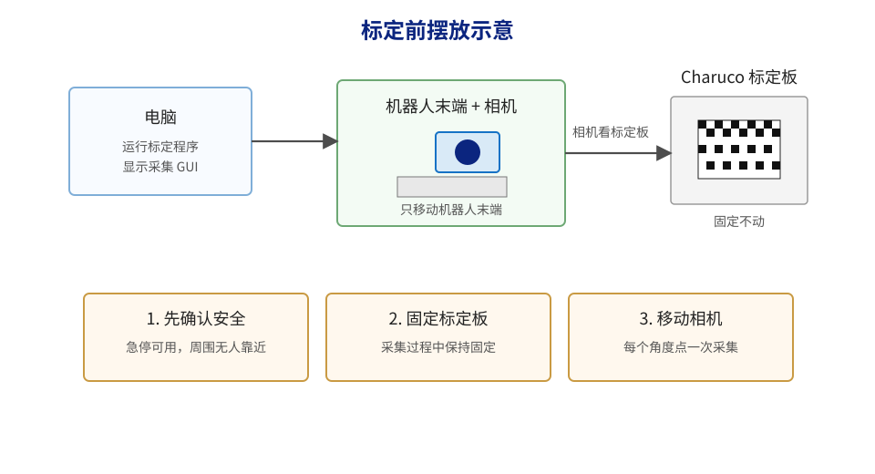
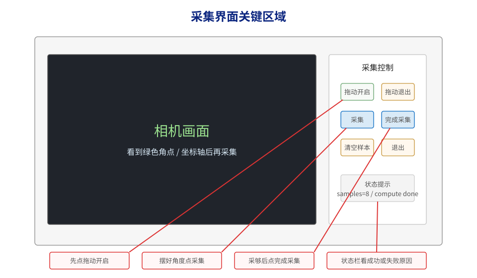
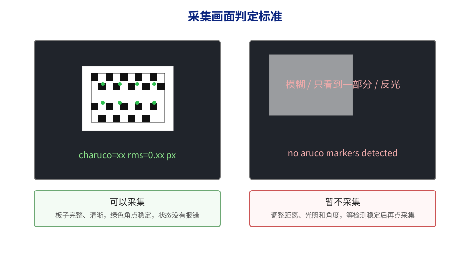
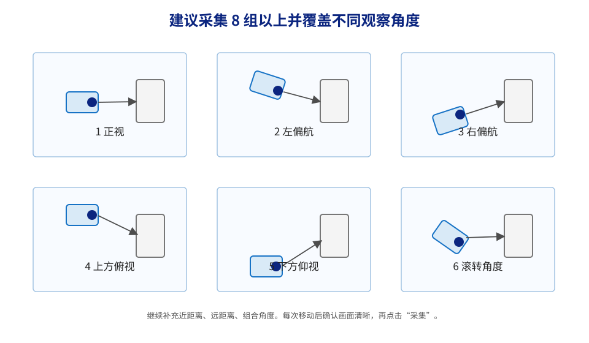
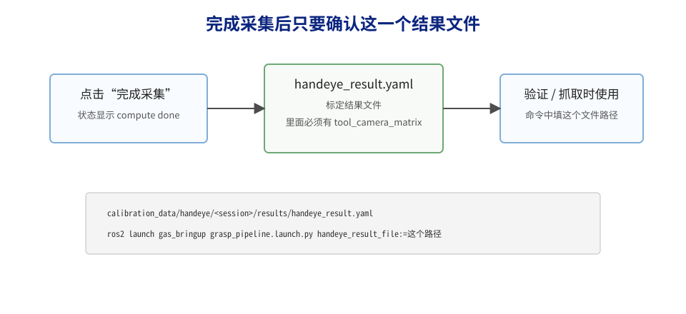

# 气罐项目手动标定操作手册

## Charuco 手眼标定操作指导

## 1. 操作目标

本文档用于指导现场操作人员完成一次 Charuco 手眼标定流程。操作人员只需按步骤完成准备、启动、采集、计算、验证和结果引用，无需理解 ROS2 内部实现或项目源码。

本次手动标定流程包括：

1. 固定 Charuco 标定板。
2. 启动手动标定程序。
3. 点击 `拖动开启`，通过拖动示教移动机器人末端。
4. 每调整到一个合适角度，确认画面清晰后点击一次 `采集`。
5. 采集足够样本后点击 `完成采集`。
6. 使用生成的结果文件进行验证和后续抓取。

完成后需确认生成以下结果文件：

```text
calibration_data/handeye/<session>/results/handeye_result.yaml
```

其中 `<session>` 是程序自动生成的一串时间编号，例如 `20260904_163416`。

## 2. 标定前准备



图 1 标定前摆放示意

### 2.1 现场准备清单

| 检查项 | 正确状态 | 处理方式 |
| --- | --- | --- |
| 机器人急停 | 急停按钮可用，操作人员能随时按到 | 禁止开始标定 |
| 机器人周围 | 机器人活动范围内无人、无杂物 | 清空现场后再继续 |
| 机器人模式 | 控制器处于远程控制模式 | 切换到远程模式 |
| 相机 | 相机固定在机器人末端，不能晃动 | 拧紧相机后重新标定 |
| 标定板 | 标定板固定在桌面、支架或工装上 | 固定牢固后再继续 |
| 光照 | 标定板无明显反光、无大面积阴影 | 调整灯光或标定板角度 |

### 2.2 关键操作规则

| 规则 | 原因 |
| --- | --- |
| 标定板固定后保持不动 | 程序默认所有照片看到的是同一块固定标定板 |
| 只移动机器人末端和相机 | 使相机从不同角度观察同一块板 |
| 画面模糊时暂停采集 | 模糊样本会降低标定质量 |
| 相机或夹具松动后必须重标 | 标定结果只对当前安装位置有效 |
| TCP 设置变化后必须重标 | 机器人末端坐标变了，旧结果不能继续用 |

## 3. 启动标定程序

### 3.1 打开终端

在 Ubuntu 桌面打开一个终端，依次执行以下命令：

```bash
cd ~/SyhDev/cylinder_project
source /opt/ros/humble/setup.bash
source install/setup.bash
```

然后启动标定程序：

```bash
ros2 launch gas_bringup handeye_collection.launch.py
```

### 3.2 等待界面出现

正常会出现一个手眼采集窗口。窗口左侧是相机画面，右侧是按钮。

如果窗口没有出现，先查看终端报错信息。常见原因包括相机未连接、机器人网络不通、未加载 `source install/setup.bash`。

## 4. 采集界面说明



图 2 采集界面按钮说明

### 4.1 操作人员关注项

| 位置 | 看什么 |
| --- | --- |
| 左侧相机画面 | 标定板是否完整、清晰，是否能看到绿色角点或坐标轴 |
| `拖动开启` | 开始手动拖机器人 |
| `采集` | 当前角度合适时点击一次 |
| 状态提示区域 | 看样本数量、成功提示或失败原因 |

### 4.2 按钮功能

| 按钮 | 使用时机 | 执行结果 |
| --- | --- | --- |
| `拖动开启` | 准备移动机器人时 | 机器人进入可拖动状态 |
| `拖动退出` | 需要结束拖动时 | 机器人退出拖动状态 |
| `采集` | 相机画面清楚、角点稳定时 | 保存当前这一组标定数据 |
| `完成采集` | 采集至少 5 组，建议 8 组以上后 | 程序计算并保存标定结果 |
| `清空样本` | 需要废弃当前样本并重新采集时 | 当前窗口已采样本清零 |
| `退出` | 标定结束或放弃本次标定时 | 关闭窗口，并尝试退出拖动状态 |

## 5. 采集画面要求



图 3 可采集和不可采集画面对比

### 5.1 可以点击“采集”的画面

| 条件 | 判断方法 |
| --- | --- |
| 标定板在画面中 | 能看到大部分 Charuco 板 |
| 图像清晰 | 黑白格边缘清楚，没有明显拖影 |
| 角点稳定 | 画面上能看到绿色角点、Marker 标注或坐标轴 |
| 光照正常 | 不过曝、不发白、不大面积反光 |
| 距离合适 | 标定板不宜过小，也不宜过近导致画面显示不完整 |

### 5.2 不符合采集条件的画面

| 现象 | 处理方式 |
| --- | --- |
| 画面提示 `waiting for camera` | 等相机启动，或检查相机连接 |
| 看不到标定板 | 移动机器人，让相机对准标定板 |
| 只看到标定板一小角 | 调整距离和角度，让板子多进入画面 |
| 图像模糊 | 停稳机器人，重新对准后再采集 |
| 标定板反光 | 调整灯光或标定板角度 |
| 状态提示检测失败 | 暂停采集，先调整画面 |

## 6. 手动标定操作流程

### 6.1 标准流程

| 步骤 | 操作内容 | 正常现象 |
| --- | --- | --- |
| 1 | 固定标定板 | 板子不会被碰动 |
| 2 | 启动标定程序 | 出现采集 GUI |
| 3 | 把机器人拖到能看到标定板的位置 | 左侧有实时画面 |
| 4 | 点击 `拖动开启` | 机器人可被手动拖动 |
| 5 | 调整到第一个角度 | 标定板清晰、角点稳定 |
| 6 | 点击 `采集` | 状态显示 `sample stored`，样本数加 1 |
| 7 | 换一个明显不同的角度 | 避免只进行小幅平移 |
| 8 | 再点击 `采集` | 样本数继续增加 |
| 9 | 重复采集 | 至少 5 组，建议 8 组以上 |
| 10 | 点击 `完成采集` | 状态显示 `compute done` 和结果路径 |
| 11 | 记录结果路径 | 后续验证和抓取都用这个文件 |

### 6.2 推荐采样姿态



图 4 推荐采集姿态

建议至少采 8 组。可以按下面顺序采：

| 第几组 | 姿态 | 操作说明 |
| --- | --- | --- |
| 1 | 正视 | 相机大致正对标定板 |
| 2 | 左偏 | 从左侧斜着看标定板 |
| 3 | 右偏 | 从右侧斜着看标定板 |
| 4 | 上方 | 相机从偏上方向下看 |
| 5 | 下方 | 相机从偏下方向上看 |
| 6 | 左滚转 | 末端绕相机方向轻微旋转 |
| 7 | 近一点 | 靠近一些，但标定板要看得全 |
| 8 | 远一点 | 远一些，但角点仍要清楚 |

继续补充样本时，可以采“左偏加上方”“右偏加滚转”等组合角度。

### 6.3 禁止采样的情况

| 错误做法 | 后果 |
| --- | --- |
| 标定板被碰动后继续采 | 结果会明显错误 |
| 只在一个位置附近采很多张 | 样本数量够了，标定仍可能不准 |
| 每张都几乎正视 | 旋转变化不足，结果不稳定 |
| 画面中板子太小 | 角点误差变大 |
| 画面中板子只剩一部分 | 容易检测失败或位姿不稳 |
| 机器人还在晃动时点采集 | 图片可能模糊 |

## 7. 采集与计算结果确认

### 7.1 单次采集成功

点击 `采集` 后，状态区域出现类似内容，表示这一组保存成功：

```text
sample 0 stored, samples=1, reprojection=0.xxxpx
```

其中 `samples=1` 表示当前已经有 1 组有效样本。后面每成功一次都会增加。

### 7.2 单次采集失败

如果出现下面提示，不算成功样本，需要调整后重新采：

| 提示 | 含义 | 处理方式 |
| --- | --- | --- |
| `no color image received` | 没收到相机图像 | 检查相机和程序启动 |
| `no camera info received` | 没收到相机内参 | 等相机完全启动或重启程序 |
| `robot pose service unavailable` | 读不到机器人位置 | 检查机器人控制节点和网络 |
| `no aruco markers detected` | 没看到标定板 Marker | 让相机对准标定板，调光照 |
| `no charuco corners interpolated` | 角点不够稳定 | 让板子更完整、更清晰 |
| `estimatePoseCharucoBoard failed` | 标定板位姿求解失败 | 换一个不那么极端的角度 |

### 7.3 计算成功

采集完成后点击 `完成采集`。状态区域出现类似内容表示成功：

```text
compute done, samples=8, rms=0.xxxpx, result=calibration_data/handeye/20260904_163416/results/handeye_result.yaml
```

需记录 `result=` 后面的路径。



图 5 结果文件使用示意

### 7.4 计算失败

| 提示 | 含义 | 处理方式 |
| --- | --- | --- |
| `not enough samples` | 有效样本少于 5 组 | 继续采集，至少到 5 组 |
| `failed to save result file` | 结果文件保存失败 | 检查磁盘空间和目录权限 |
| `compute failed` | 计算失败 | 先清空样本，按推荐角度重新采一轮 |

## 8. 标定结果保存位置

每次启动标定程序，都会创建一个新的 session 目录。

标定结果一般在：

```text
calibration_data/handeye/<session>/results/handeye_result.yaml
```

同一次标定的数据结构如下：

```text
calibration_data/handeye/<session>/
├── session.yaml
├── samples/
│   ├── sample_0000.yaml
│   ├── sample_0000_raw.png
│   └── ...
├── debug/
│   ├── sample_0000_debug.png
│   └── ...
└── results/
    └── handeye_result.yaml
```

现场操作时主要关注以下文件：

| 文件 | 用途 |
| --- | --- |
| `handeye_result.yaml` | 标定最终结果，验证和抓取要用 |
| `sample_xxxx_raw.png` | 每次采集的原图 |
| `sample_xxxx_debug.png` | 带角点标注的图，出问题时给工程人员看 |

## 9. 标定结果验证

标定完成后建议做一次验证。验证的目的不是重新标定，而是检查本次生成的标定结果是否稳定可靠。

### 9.1 启动验证程序

将 `<session>` 替换为本次结果路径中的实际编号：

```bash
cd ~/SyhDev/cylinder_project
source /opt/ros/humble/setup.bash
source install/setup.bash
ros2 launch gas_bringup handeye_validation.launch.py \
  handeye_result_file:=calibration_data/handeye/<session>/results/handeye_result.yaml
```

### 9.2 验证采样步骤

验证和标定一样，也是固定标定板，然后拖机器人换角度采样。

| 步骤 | 操作 |
| --- | --- |
| 1 | 确认验证界面显示的结果文件为本次生成的 `handeye_result.yaml` |
| 2 | 标定板保持固定，不要移动 |
| 3 | 点击 `拖动开启` |
| 4 | 换不同角度观察标定板 |
| 5 | 每个角度点击 `采集验证样本` |
| 6 | 建议采 8 组以上 |
| 7 | 点击 `生成报告` |

### 9.3 验证报告位置

```text
calibration_data/handeye_validation/<session>/results/precision_validation_report.md
```

报告里主要看：

| 指标 | 越小越好 | 说明 |
| --- | --- | --- |
| `reprojection_rms_px` | 是 | 图像角点拟合质量 |
| `validation_translation_rms_mm` | 是 | 换不同角度后，算出来的板子位置差多少毫米 |
| `validation_rotation_rms_deg` | 是 | 换不同角度后，算出来的板子方向差多少度 |

如果图像误差很小，但毫米误差很大，通常不是“图像没识别到”，而是标定板动了、相机松了、TCP 不一致、结果文件选错或采样角度太单一。

## 10. 把标定结果用于抓取

验证通过后，抓取程序启动时要指定这次的结果文件。

```bash
cd ~/SyhDev/cylinder_project
source /opt/ros/humble/setup.bash
source install/setup.bash
ros2 launch gas_bringup grasp_pipeline.launch.py \
  handeye_result_file:=calibration_data/handeye/<session>/results/handeye_result.yaml
```

不得随意使用旧的 `handeye_result.yaml`。如果不确定哪一份是最新结果，需由工程人员确认。

## 11. 现场快速操作卡

以下内容可作为现场快速操作卡使用。

| 顺序 | 操作 |
| --- | --- |
| 1 | 固定标定板，确认急停和机器人周围安全 |
| 2 | 终端执行 `ros2 launch gas_bringup handeye_collection.launch.py` |
| 3 | GUI 出现后点 `拖动开启` |
| 4 | 让相机清楚看到标定板 |
| 5 | 点 `采集` |
| 6 | 换一个明显不同角度，再点 `采集` |
| 7 | 至少 5 组，建议 8 组以上 |
| 8 | 点 `完成采集` |
| 9 | 记录 `handeye_result.yaml` 路径 |
| 10 | 用这个路径启动验证和抓取 |

启动标定：

```bash
cd ~/SyhDev/cylinder_project
source /opt/ros/humble/setup.bash
source install/setup.bash
ros2 launch gas_bringup handeye_collection.launch.py
```

启动验证：

```bash
ros2 launch gas_bringup handeye_validation.launch.py \
  handeye_result_file:=calibration_data/handeye/<session>/results/handeye_result.yaml
```

启动抓取：

```bash
ros2 launch gas_bringup grasp_pipeline.launch.py \
  handeye_result_file:=calibration_data/handeye/<session>/results/handeye_result.yaml
```

## 12. 重新标定条件

| 情况 | 是否重标 |
| --- | --- |
| 相机被拆下或移动过 | 必须 |
| 末端夹具被拆装过 | 必须 |
| 机器人 TCP 改过 | 必须 |
| 更换了标定板 | 必须 |
| 标定板尺寸配置改过 | 必须 |
| 只是重启程序 | 不需要 |
| 只是换了要抓取的气罐 | 通常不需要 |

原则：只要“相机和机器人末端的相对位置”发生变化，就必须重新标定。
